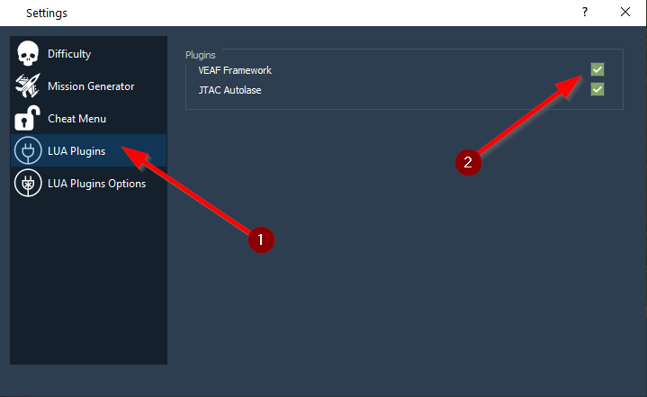
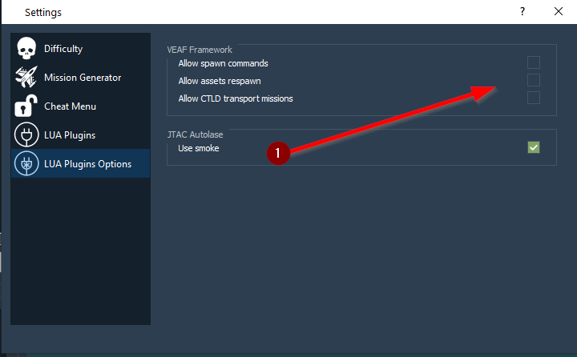

# VEAF Scripts as a plugin to dcs-liberation

All scripts, libraries and documentation needed to build a mission containing the VEAF framework with [dcs-liberation](https://github.com/Khopa/dcs_liberation).

## Installing the plugin in dcs-liberation

Could not be simpler : 
 - create a new `veaf` directory in dcs-liberation's `resources\plugins` 
 - copy all the files in `dist` to this new folder
 - edit dcs-liberation's `resources\plugins\plugins.json` file to add the veaf plugin to the top of the plugins list ; the result should look like :
 ```json
 [
    "veaf",
    "jtacautolase",
    "base"
]
 ```

## Using the VEAF plugin in dcs-liberation

In the *Settings* window, you'll see an option to select this new plugin in the *LUA Plugins* section :



Also, you can change the default options in the *LUA Plugins Options* section :



These options are :

 - *Allow spawn commands* : if disabled, no command can spawn additional units (disables SPAWN, SHORTCUTS, CASMISSION and TRANSPORTMISSION)
 - *Allow assets respawn* : if disabled, the ASSET menu will show the assets but it will not be possible to respawn or dispose them (not yet functional)
 - *Allow CTLD transport missions* : if disabled, CTLD will be disabled altogether

## Playing in such a mission

*TODO*

## Refreshing the scripts in this repository

Requirements:

* git
* an IDE (Notepad++, Visual Studio Code, etc.)
* npm - you can install [node.js from here](https://nodejs.org/en/download/)

Edit the `package.json` file to change the version of the VEAF framework you want to fetch.
Run the `build.cmd` script and then check that the scripts in `dist` have been updated.
Commit.